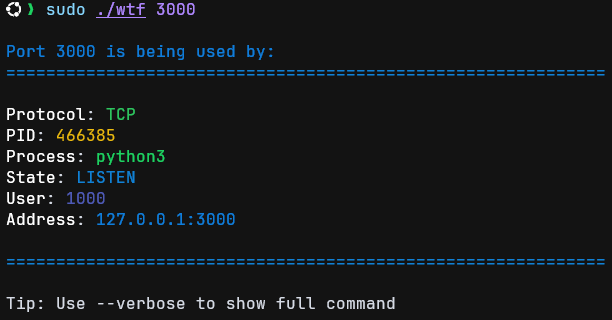

# Who The FUCK
**Vibe Coding** warning  
A simple tool that lets you use `wtf <port>` to find out what the hell is occupying that port.



## Installation
<details>
<summary><h3>Compile From Source</h3></summary>

#### Step 1
Install the curl and Rust Compiler:
```bash
sudo apt install curl
curl --proto '=https' --tlsv1.2 -sSf https://sh.rustup.rs | sh -s -- -y
. $HOME/.cargo/env
```

#### Step 2
Clone the repository:
```bash
sudo apt install git
git clone https://github.com/WoodManGitHub/wtf.git
```

#### Step 3
Compile wtf:
```bash
cargo build --release
```

#### Step 4
Move the binary to a directory in your PATH:
```bash
sudo mv target/release/wtf /usr/local/bin/
```

</details>

## Usage
```bash
Who the FUCK is using this port?

Usage: wtf [OPTIONS] <PORT>

Arguments:
  <PORT>

Options:
  -v, --verbose
  -a, --all
  -h, --help     Print help
  -V, --version  Print version
```
